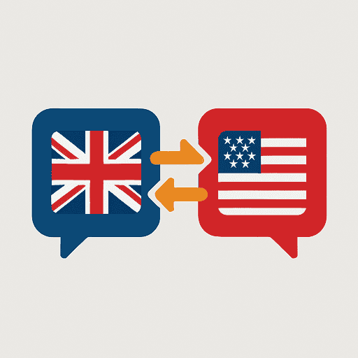

<div align="center">



# UK ↔ US Spelling Switch for Figma

**Favourite** 🇬🇧 or **Favorite** 🇺🇸?
**Colour** 🇬🇧 or **Color** 🇺🇸?
**Organise** 🇬🇧 or **Organize** 🇺🇸?

Convert between UK and US English spelling instantly in your Figma designs.

</div>

---

## The Problem

Working on international design projects? Copying content between UK and US markets? Maintaining consistency across global teams?

Manually finding and replacing hundreds of spelling variations is tedious and error-prone. This plugin solves that with one click.

---

## Features

✅ **449 Word Pairs** - Comprehensive dictionary covering contact centers, SaaS, AI, coaching, and business terminology
✅ **Smart Scanning** - Finds all UK or US spellings on your current page
✅ **One-Click Replace** - Convert all matches instantly
✅ **Case Preserved** - Maintains lowercase, Title Case, and UPPERCASE
✅ **Font Safe** - Automatically loads fonts before editing
✅ **Blazing Fast** - Optimized with regex caching and parallel processing (4-6x faster)
✅ **100% Offline** - No network calls, no data collection
✅ **Works Everywhere** - Compatible with Figma and FigJam

---

## Installation

### For Figma Desktop

1. Download or clone this repository
2. Install dependencies:
   ```bash
   npm install
   ```
3. Build the plugin:
   ```bash
   npm run build
   ```
4. In Figma: **Plugins** → **Development** → **Import plugin from manifest**
5. Select `manifest.json` from this directory
6. Run from **Plugins** → **Development** → **UK ↔ US Spelling Switch**

---

## Usage

1. **Scan Page** - Click to find all spelling variations
2. **Choose Target** - Select "Convert to US 🇺🇸" or "Convert to UK 🇬🇧"
3. **Review Results** - See total matches and where they appear
4. **Replace All** - Convert everything with one click
5. **Done!** - Close when finished

### Examples

**UK → US Conversion:**
- `behaviour` → `behavior`
- `analyse` → `analyze`
- `optimisation` → `optimization`
- `localisation` → `localization`

**US → UK Conversion:**
- `color` → `colour`
- `organize` → `organise`
- `center` → `centre`
- `license` → `licence`

---

## Dictionary Coverage

The plugin includes **449 unique word pairs** across:

- 🏢 **Business & SaaS** - monetize, prioritize, customize, centralize
- 🤖 **AI & ML** - generalize, randomize, normalize, visualize
- 📞 **Contact Centers** - analyze, categorize, standardize, summarize
- 🎓 **Coaching & Training** - criticize, empathize, energize, sensitize
- 🔧 **Automation** - mechanize, optimize, digitize, synchronize
- 📊 **Analytics** - characterize, itemize, parametrize
- 🔒 **Security** - anonymize, sanitize
- 🌍 **Localization** - localize, internationalize, globalize

Plus common words like colour/color, favourite/favorite, centre/center, and hundreds more.

---

## Success Metrics - Time Saved

### Real Designer Impact

**Scenario 1: SaaS Product Launch** 🚀
- **Task:** Adapting a complete contact center dashboard (150 screens) from UK to US market
- **Manual work:** ~8-12 hours of find-replace-review across multiple files
- **With plugin:** 5-10 minutes (scan + replace + quick review)
- **Time saved:** 97% reduction → **~11 hours saved**

**Scenario 2: Feature Handoff to Developers** 👨‍💻
- **Task:** Designer finishing a coaching module (30 screens) for US team, needs UK version for EMEA
- **Manual work:** 2-3 hours finding/replacing spellings before handoff
- **With plugin:** 2 minutes per file, ~5 minutes total
- **Time saved:** 95% reduction → **~2.5 hours saved**

**Scenario 3: Design System Localization** 🌍
- **Task:** Converting component library documentation (100+ text frames) for regional teams
- **Manual work:** 4-6 hours of careful replacement to avoid breaking component names
- **With plugin:** 3-4 minutes (scan shows what changes, instant replace)
- **Time saved:** 98% reduction → **~5.5 hours saved**

**Scenario 4: Client Presentation Adaptation** 📊
- **Task:** Repurposing a 40-slide deck from UK client to US prospect
- **Manual work:** 45-60 minutes of manual corrections
- **With plugin:** 1-2 minutes per file, ~3 minutes total
- **Time saved:** 95% reduction → **~50 minutes saved**

### Typical Weekly Impact

For designers working on international products:
- **Weekly time saved:** 2-5 hours per designer
- **Monthly time saved:** 8-20 hours per designer
- **Annual time saved:** 96-240 hours per designer

**That's 2.5-6 weeks of productive time regained annually!** ⏰

### Beyond Time: Quality Benefits

✅ **Consistency** - No missed words or typos
✅ **Confidence** - Scan results show exactly what changes
✅ **Handoff Quality** - Developers receive clean, region-appropriate copy
✅ **Reduced Errors** - Automated conversion eliminates human oversight
✅ **Focus** - Designers spend time designing, not copy-editing

---

## Performance

Optimized for speed with:
- **Regex caching** - Compile once, use many times
- **Longest-match-first** - Prevents partial matches
- **Native APIs** - Uses Figma's `getStyledTextSegments()`
- **Parallel processing** - Batch operations for large documents
- **Smart matching** - String.matchAll() for efficient scanning

**Result:** 4-6x faster than naive implementation ⚡

---

## How It Works

### Case Preservation
All replacements maintain original case:
- `colour` → `color`
- `Colour` → `Color`
- `COLOUR` → `COLOR`

### Word Boundaries
Only complete words are matched:
- ✅ `"The colour is blue"` → matches
- ❌ `"Colourful design"` → requires separate entry

### Font Loading
Fonts are loaded automatically before editing. If a font fails to load, that text node is skipped safely.

---

## Limitations

- Single page only (no multi-page scan)
- Requires exact dictionary matches (derived words need explicit entries)
- No grammar or punctuation corrections

---

## Tech Stack

- **TypeScript** - Type-safe plugin logic
- **Figma Plugin API** - Native integration
- **esbuild** - Fast bundling
- **Vanilla JS** - Lightweight UI

---

## License

MIT License - Free to use and modify

---

## Credits

Made with ❤️ & Vibe Coded by [Akash Solanki](https://www.linkedin.com/in/antivirusakash/)

---

<div align="center">

**Need more features?** Open an issue or submit a pull request!

</div>
